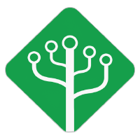
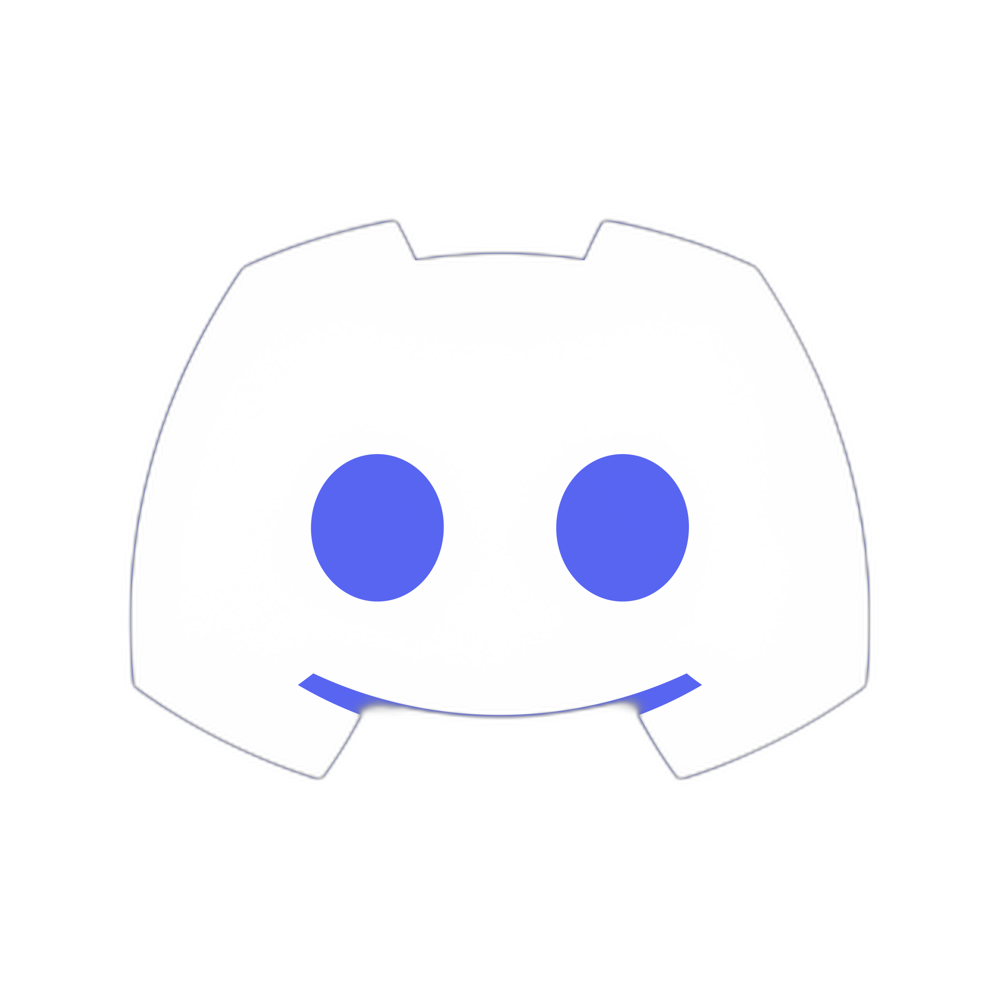

---
hide:
  - navigation
---

# Página Inicial

## :heavy_check_mark: Objetivo

Somos uma **Associação** com o desejo de democratizar o aprendizado tecnológico e aproximar novas gerações do conteúdo técnico.

A **Associação Codaqui** ajuda diretamente crianças e jovens a aprender programação enquanto desenvolvem soluções para problemas reais. Tudo sem custo algum.

Além disso a **Codaqui** também reúne outras comunidades e fornece o apoio para gestão de projetos e uma estrutura "burocrática" caso o seu projeto não a tenha.

## :fontawesome-solid-graduation-cap: Nossa solução

-   :material-tally-mark-1:{ .lg .middle } __Autonomia no aprendizado__

    ---

    Os alunos percorrem de forma autônoma algumas trilhas de aprendizado criadas com a ajuda de especialistas voluntários e semanalmente encontram um mentor para atividades práticas.

-   :material-tally-mark-2:{ .lg .middle } __Resolução de problemas reais__

    ---

    Além dos projetos pessoais desenvolvido ao longo do curso, os alunos podem participar de projetos reais, de desenvolvimento de serviços e produtos para outras organizações sem fins lucrativos, podendo receber uma bolsa financeira.

-   :material-tally-mark-3:{ .lg .middle } __Acesso a computador e internet__

    ---

    Incentivamos nossos membros a ocupar espaços públicos, estabelecendo parcerias para que todos tenham acesso a computador, internet e uma estação de estudo.

-   :material-tally-mark-4:{ .lg .middle } __Comunidade de Comunidades__

    ---

    Além de todos esses benefícios, a Codaqui integra outras comunidades em sua estrutura, proporcionando oportunidades adicionais de networking e compartilhamento de conhecimento.

## :material-account-group: Comunidades Participantes

-   [{ width="85" style="display:block; margin-left:auto; margin-right:auto;" }](https://github.com/DeveloperParana)

    ---
    
    :fontawesome-brands-square-font-awesome-stroke:{ .lg .middle  } __DevParaná__

-  [{ width="200" style="display:block; margin-left:auto; margin-right:auto;" }](https://www.instagram.com/campostechpg)  
 
    ---

    :fontawesome-brands-square-font-awesome-stroke:{ .lg .middle  } __CamposTech__
    
-  [{ width="83" style="display:block; margin-left:auto; margin-right:auto;" }](https://www.instagram.com/elasnocodigo)

    ---

    
    :fontawesome-brands-square-font-awesome-stroke:{ .lg .middle  } __ElasnoCódigo__

## :material-google-circles-communities: Links Importantes

-   [{ width="188" style="display:block; margin-left:auto; margin-right:auto;" }](https://discord.com/invite/xuTtxqCPpz)

    ---

    
    :fontawesome-brands-square-font-awesome-stroke:{ .lg .middle  } __Whatsapp__

-   [{ width="97" style="display:block; margin-left:auto; margin-right:auto;" }](https://discord.com/invite/xuTtxqCPpz)   

    ---
    
    :fontawesome-brands-square-font-awesome-stroke:{ .lg .middle  } __Discord__

